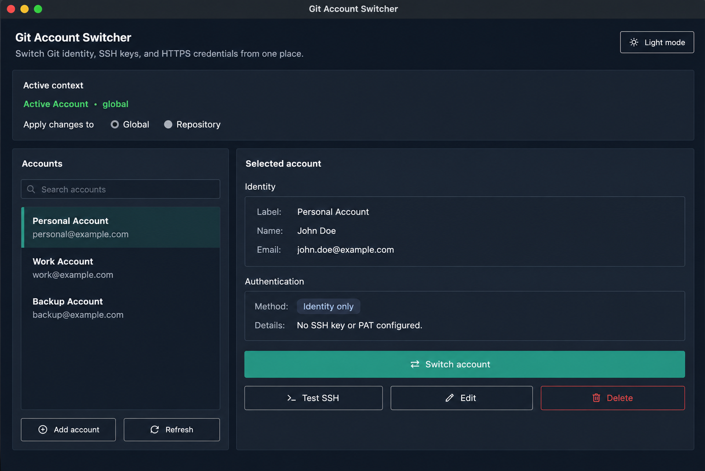

# Git Account Switcher

A lightweight desktop app for switching between Git identities, SSH keys, and HTTPS personal access tokens (PATs) without editing config files by hand.



## Features

- Save multiple Git accounts with label, `user.name`, and `user.email`
- Switch identity globally or for a single repository
- Optional SSH key activation via `ssh-add`
- Optional HTTPS PAT storage through native Git credential helpers
- Light and dark themes with persisted preference
- Local-only storage in `~/.gitswitch/`

## Security model

- Account metadata is stored in `~/.gitswitch/accounts.json`
- PAT tokens are never written to the app config file
- PATs are stored through Git's configured credential helper (Keychain, GCM, libsecret)
- The app only runs local `git` and `ssh` commands

## Requirements

- Python 3.8+ (for source installs)
- Git installed and available on `PATH`
- Tkinter (usually bundled with Python)
- A Git credential helper for PAT storage
- Optional: running `ssh-agent` for SSH key switching

### Platform setup

| Platform | Identity + SSH | PAT storage |
| --- | --- | --- |
| **macOS** | Supported | macOS Keychain via `credential.helper osxkeychain` |
| **Windows** | Supported | Git Credential Manager via `credential.helper manager` |
| **Linux** | Supported | libsecret or GCM via Git credential helper |

**macOS** — Keychain helper is usually preconfigured with Git.

**Windows** — Install [Git for Windows](https://gitforwindows.org/) with Git Credential Manager enabled.

**Linux** — Install Tkinter and libsecret support if needed:

```bash
sudo apt install python3-tk git-credential-libsecret
git config --global credential.helper /usr/share/git-core/contrib/credential/libsecret/git-credential-libsecret
```

## Download binaries

Tagged releases include standalone builds for macOS, Windows, and Linux:

1. Open [GitHub Releases](../../releases).
2. Download the asset for your platform.
3. Run the app. Git must still be installed on the machine.

Release builds are produced automatically when a version tag like `v1.0.0` is pushed.

## Run from source

```bash
python3 git_account_switcher.py
```

No external Python packages are required to run from source.

## Usage

1. Launch the app.
2. Add an account with its Git identity and optional authentication.
3. Choose whether changes apply globally or to one repository.
4. Select an account and click **Switch account**.

For SSH accounts, optionally set a host alias if you use multiple SSH host entries. For HTTPS accounts, enter the provider host, username, and PAT once; the token is saved through your Git credential helper.

## Build standalone binaries locally

Install PyInstaller in a virtual environment, then build:

```bash
pip install pyinstaller
pyinstaller git_account_switcher.spec          # macOS .app bundle
pyinstaller --onefile --windowed --name GitAccountSwitcher git_account_switcher.py  # Windows/Linux
```

Release artifacts are uploaded automatically by `.github/workflows/release.yml` when you push a tag:

```bash
git tag v1.0.0
git push origin v1.0.0
```

## Project structure

```text
git_account_switcher.py   # launcher
git_account_switcher.spec # PyInstaller config (macOS)
gitswitch/
  app.py                  # main window
  backend.py              # git/ssh/credential commands
  dialogs.py              # add/edit account dialog
  models.py               # account models and validation
  store.py                # local persistence
  theme.py                # light/dark theme styles
tests/                    # unit tests
.github/workflows/        # CI and release automation
```

## Development

Run tests:

```bash
python3 -m unittest discover -s tests
```

CI runs the same tests on macOS, Windows, and Ubuntu for every push and pull request.

See [CONTRIBUTING.md](CONTRIBUTING.md) for contribution guidelines.

## License

MIT License. See [LICENSE](LICENSE).
